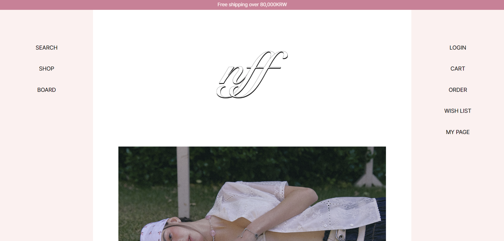
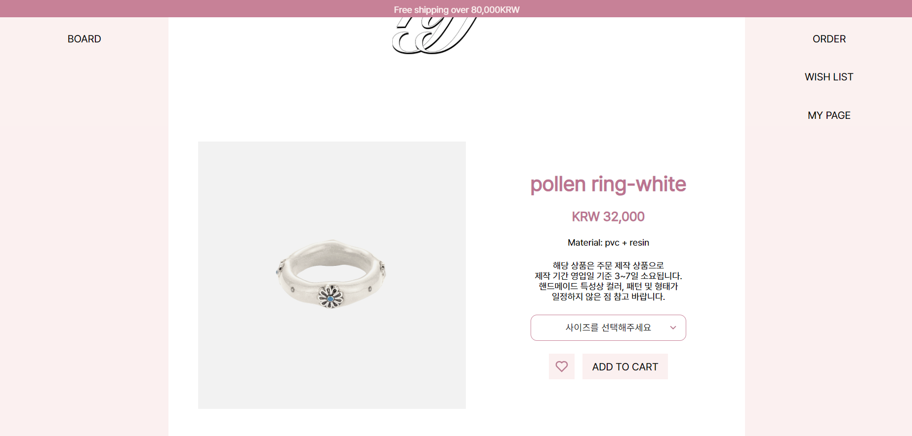
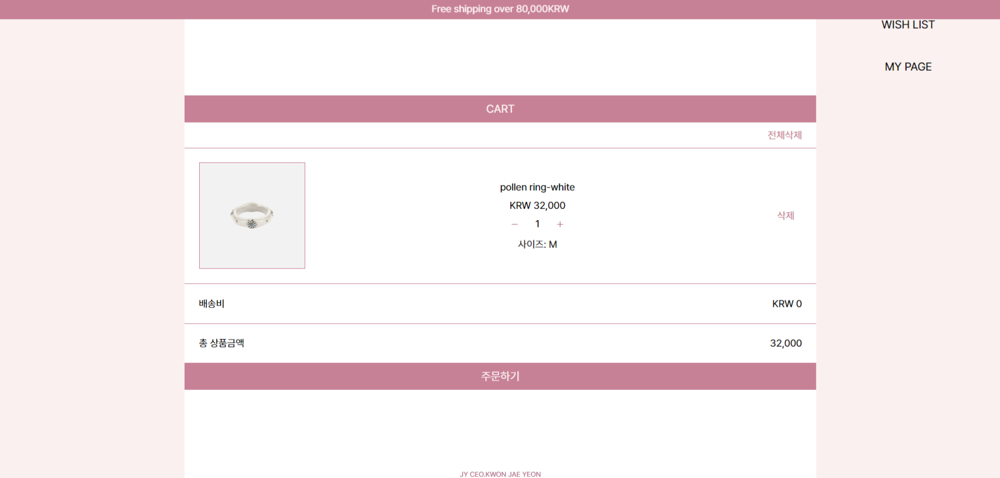
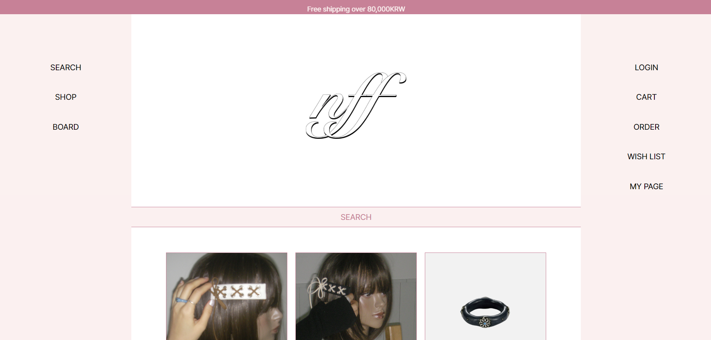
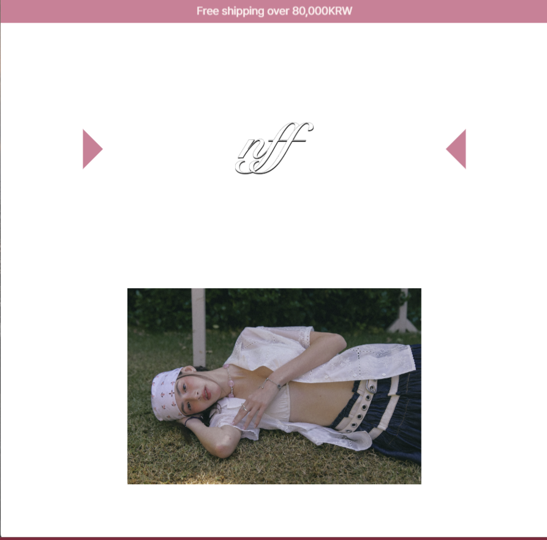
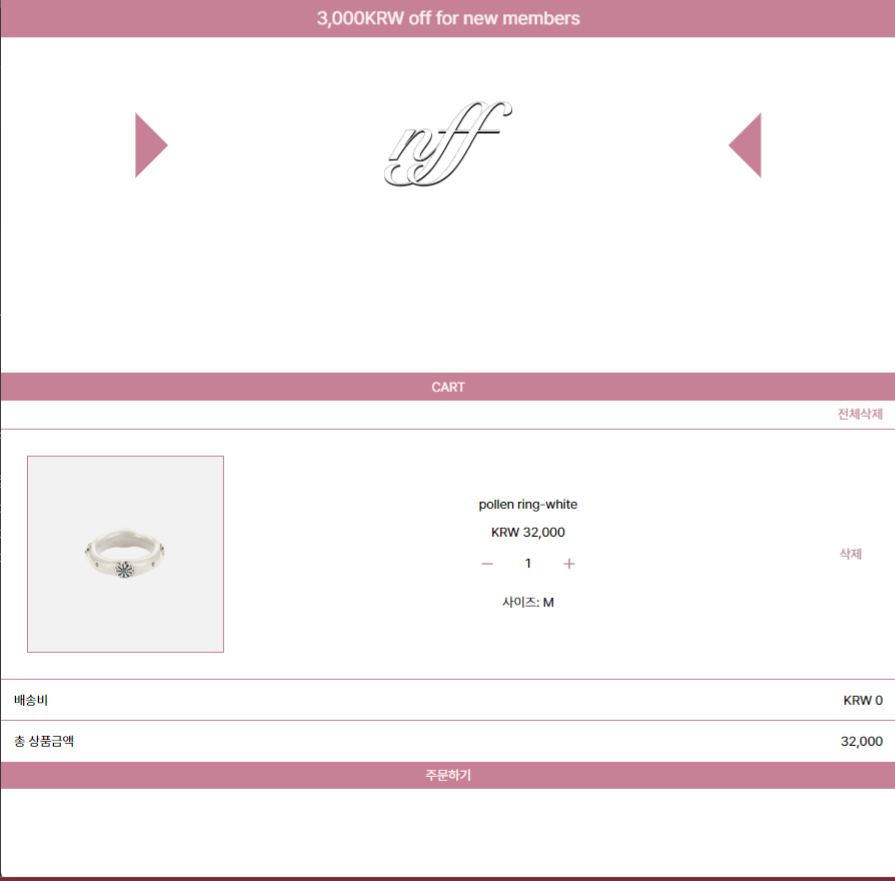

# nff
React 기반 리디자인 쇼핑몰 프로젝트

## ✨ Live Demo
- [nff](https://nff.netlify.app/)

## ✨ 주요 기능
- 카테고리 기반 동적 상세페이지
- Redux 기반 전역 상태 관리
- 카테고리 기반 조건 분기 로직 구현 (fingers 상품에만 사이즈 옵션 및 검증 적용)
- 검색 및 정렬 기능
- 장바구니 수량 및 옵션 변경 기능

## ✨ 구조 설계 포인트
1. Redux slice 단위 상태 관리
cart / wishlist / sidebar / search 상태를 모듈화하여 관리
props drilling 제거 및 유지보수성 개선
2. category 기반 동적 라우팅
useParams를 활용해 ${category}/${id} 구조 구현
이미지 경로와 JSON 데이터 구조 통일
3. originalData / visibleData 패턴 적용
원본 데이터 유지 후 필터링 및 정렬 적용
데이터 흐름 명확화

## 📂 프로젝트 구조
```
src
 ┣ components
 ┃ ┣ CartContent.js
 ┃ ┣ DetailContent.js
 ┃ ┣ Footer.js
 ┃ ┣ Header.js
 ┃ ┣ LeftSidebar.js
 ┃ ┣ LoginContent.js
 ┃ ┣ Logo.js
 ┃ ┣ MainContent.js
 ┃ ┣ Pagination.js
 ┃ ┣ ProductItems.js
 ┃ ┣ RightSidebar.js
 ┃ ┣ SearchItems.js
 ┃ ┣ SearchOverlay.js
 ┃ ┗ WishlistContent.js
 ┣ pages
 ┃ ┣ CartPage.js
 ┃ ┣ CategoryPage.js
 ┃ ┣ DetailPage.js
 ┃ ┣ LoginPage.js
 ┃ ┣ MainPage.js
 ┃ ┣ SearchPage.js
 ┃ ┗ WishListPage.js
 ┣ store
 ┃ ┣ cartSlice.js
 ┃ ┣ pageSlice.js
 ┃ ┣ productSlice.js
 ┃ ┣ searchSlice.js
 ┃ ┣ sidebarSlice.js
 ┃ ┣ userSlice.js
 ┃ ┗ wishlistSlice.js
 ┣ style
 ┃ ┣ main.scss
 ┃ ┣ reset.scss
 ┃ ┣ main.css
 ┃ ┣ reset.css
 ┃ ┣ main.css.map
 ┃ ┗ reset.css.map
 ┣ App.js
 ┣ App.css
 ┣ index.js
 ┣ index.css
 ┗ store.js
```
```
components: UI 단위 컴포넌트 (콘텐츠/사이드바/오버레이 등)
pages: 라우팅 단위 페이지 컴포넌트
store: Redux Toolkit slice 및 전역 상태 관리
style: SCSS 기반 스타일 관리 및 빌드된 CSS
```
## 📷 Screenshots
```
screenshots
 ┣ main-pc.png
 ┣ detail-pc.png
 ┣ cart-pc.png
 ┣ search-pc.png
 ┣ main-mobile.png
 ┣ cart-mobile.png

```
### Desktop
상품 리스트 및 상세페이지 구조와 상태 관리 흐름 확인
<p align="center">
  
  
</p>

<p align="center">
  
  
</p>

### Mobile
반응형 레이아웃 및 사이드바/장바구니 UI 동작을 확인
<p align="center">
  
  
</p>

## ✨개선 및 확장 계획
- 주문/결제 플로우 추가
- 로그인 유지 및 보호 라우트 적용
- API 연동 및 UX 상태 처리 
- 마이페이지 확장 

## 🛠 Tech Stack
<p>      </p>
