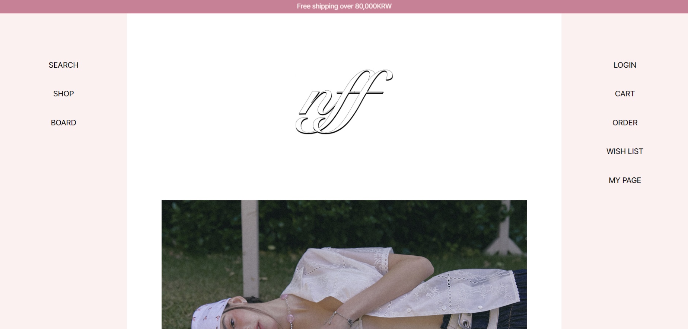
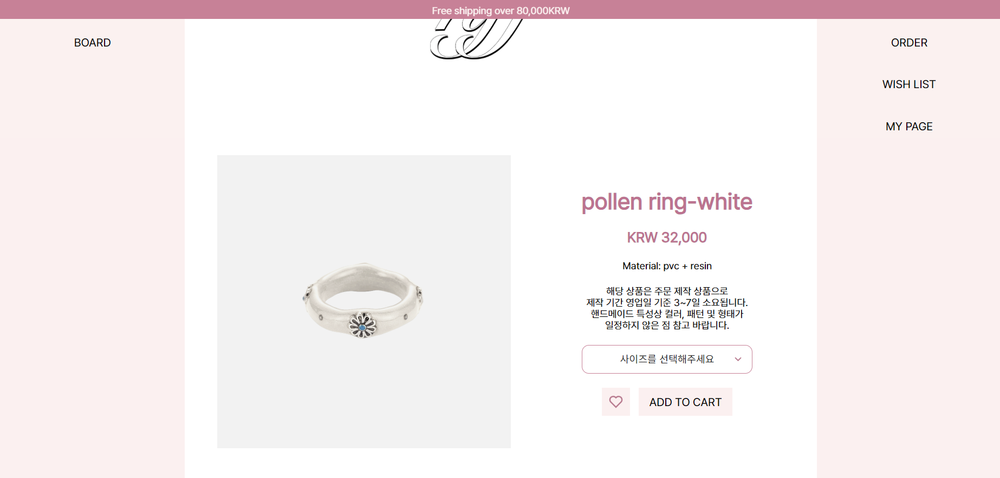
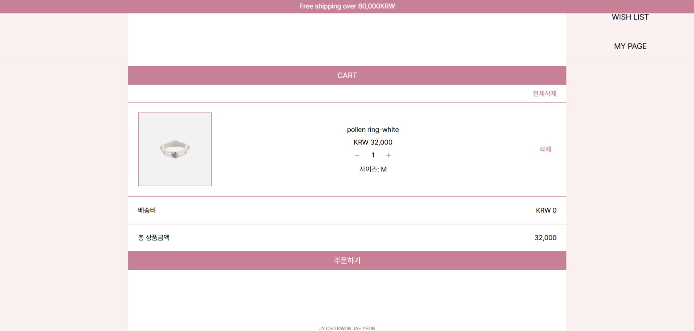
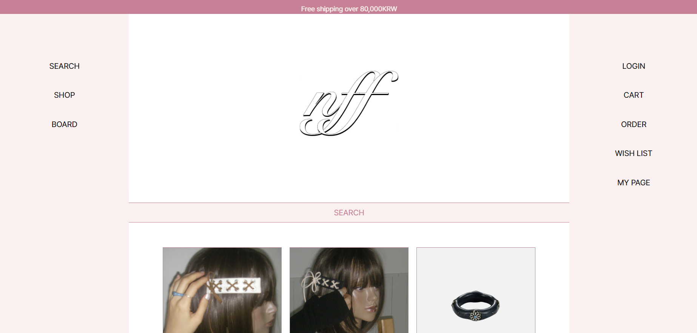
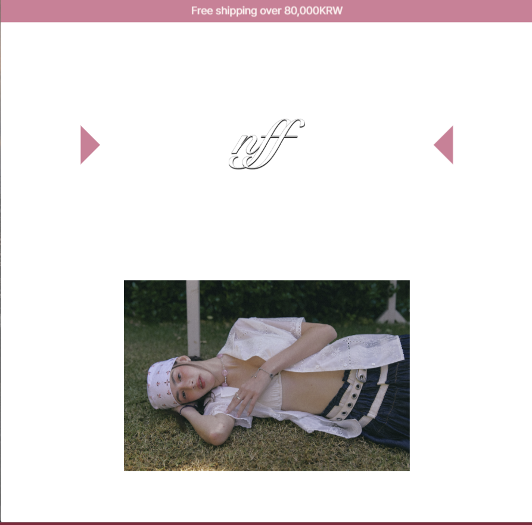
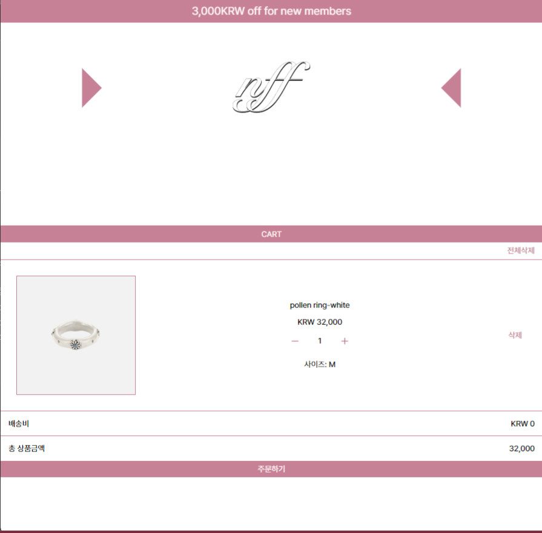

# nff
상품 탐색부터 장바구니까지의 사용자 흐름을 직접 설계하고, <br>
Redux 기반 상태 관리 구조와 컴포넌트 재사용성을 고려해 구현한 <br>
React 기반 반응형 리디자인 쇼핑몰 프로젝트입니다.

## ✨ Live Demo
- [nff](https://nff.netlify.app/)

## 🚀 실행 방법
```bash
npm install
npm start
```

## ✨ 주요 기능
### 사용자 기능
- 카테고리 기반 동적 상세페이지
- 카테고리 기반 조건 분기 로직 구현 (fingers 상품에만 사이즈 옵션 및 검증 적용)
- 검색 및 정렬 기능
- 장바구니 수량 및 옵션 변경 기능

### 상태 관리 및 구조
- Redux Toolkit 기반 전역 상태 관리<br>(cart / wishlist / sidebar / search / user / product / pages)
- 로그인 상태 관리 (userSlice)

## ✨ 주요 기술적 결정
### 1. 컴포넌트 재사용성 개선

- 초기: 카테고리별 개별 컴포넌트
  (FingerItems, HairItems, NeckItems)
- 리팩토링: 공통 ProductItems 컴포넌트로 통합
- 결과: 코드 중복 제거 및 유지보수성 향상

반복되는 UI 구조를 하나의 재사용 가능한 컴포넌트로 통합하여
데이터 기반 렌더링 구조로 개선했습니다.


### 2. 상태 관리 구조 개선

- 초기: props 전달 중심 구조
- 리팩토링: Redux 기반 전역 상태 관리로 전환
- 결과: props drilling 제거 및 구조 단순화

cart / wishlist / sidebar / search / user / product / page 상태를 slice 단위로 분리하여
확장 가능한 전역 상태 관리 구조를 설계했습니다.


### 3. 데이터 흐름 명확화

originalData / visibleData 패턴을 적용하여
원본 데이터를 유지한 채 필터링 및 정렬을 수행하도록 설계했습니다.

이를 통해 데이터 변형 과정의 예측 가능성과 유지보수성을 확보했습니다.


### 4. Category 기반 동적 라우팅

useParams를 활용해 `${category}/${id}` 구조를 구현하고
이미지 경로 및 데이터 구조를 통일하여
카테고리 확장에 유연한 구조를 설계했습니다.

## 📂 프로젝트 구조
```
src
 ┣ components
 ┃ ┣ CartContent.js
 ┃ ┣ DetailContent.js
 ┃ ┣ Footer.js
 ┃ ┣ Header.js
 ┃ ┣ LeftSidebar.js
 ┃ ┣ LoginContent.js
 ┃ ┣ Logo.js
 ┃ ┣ MainContent.js
 ┃ ┣ Pagination.js
 ┃ ┣ ProductItems.js
 ┃ ┣ RightSidebar.js
 ┃ ┣ SearchItems.js
 ┃ ┣ SearchOverlay.js
 ┃ ┗ WishlistContent.js
 ┣ pages
 ┃ ┣ CartPage.js
 ┃ ┣ CategoryPage.js
 ┃ ┣ DetailPage.js
 ┃ ┣ LoginPage.js
 ┃ ┣ MainPage.js
 ┃ ┣ SearchPage.js
 ┃ ┗ WishListPage.js
 ┣ store
 ┃ ┣ cartSlice.js
 ┃ ┣ pageSlice.js
 ┃ ┣ productSlice.js
 ┃ ┣ searchSlice.js
 ┃ ┣ sidebarSlice.js
 ┃ ┣ userSlice.js
 ┃ ┗ wishlistSlice.js
 ┣ style
 ┃ ┣ main.scss
 ┃ ┣ reset.scss
 ┃ ┣ main.css
 ┃ ┣ reset.css
 ┃ ┣ main.css.map
 ┃ ┗ reset.css.map
 ┣ App.js
 ┣ App.css
 ┣ index.js
 ┣ index.css
 ┗ store.js
```
- components: UI 단위 컴포넌트 (콘텐츠/사이드바/오버레이 등)
- pages: 라우팅 단위 페이지 컴포넌트
- store: Redux Toolkit slice 및 전역 상태 관리
- style: SCSS 기반 스타일 관리 및 빌드된 CSS

## 📷 Screenshots
```
screenshots
 ┣ main-pc.png
 ┣ detail-pc.png
 ┣ cart-pc.png
 ┣ search-pc.png
 ┣ main-mobile.png
 ┣ cart-mobile.png

```
### Desktop
상품 리스트 및 상세페이지 구조와 상태 관리 흐름 확인
<p align="center">
  
  
</p>

<p align="center">
  
  
</p>

### Mobile
반응형 레이아웃 및 사이드바/장바구니 UI 동작을 확인
<p align="center">
  
  
</p>

## ✨개선 및 확장 계획
- 주문/결제 플로우 확장 (주문서 → 결제 → 완료 페이지)
- 로그인 유지 및 보호 라우트 적용
- API 연동 및 로딩/에러/빈 상태 처리
- 마이페이지 확장 (주문 내역 / 위시리스트 관리)

## 🛠 Tech Stack
<p>
  
  
  
  
  
  
</p>

